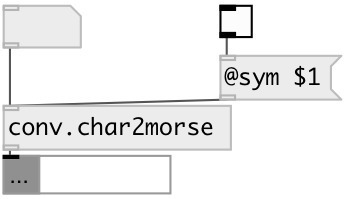

[index](index.html) :: [conv](category_conv.html)
---

# conv.char2morse
**aliases:** [ceammc/char-&gt;morse], [char-&gt;morse]

###### convert character to morse code

*available since version:* 0.9.7

---

## information
Note: cyrillic utf-8 characters are also supported.

## properties:

* **@sym** 
Get/set symbol output mode. If on - output as list of dots and dashes, otherwise as 0
and 1. 
_type:_ bool 
_default:_ 0 

## inlets:

* single characted 
_type:_ control

## outlets:

* list of 0 and 1 (or dots and dashes) 
_type:_ control

## keywords:

[conv](keywords/conv.html)
[char](keywords/char.html)
[morse](keywords/morse.html)

**See also:**
[\[proto.morse\]](proto.morse.html)

**Authors:** Serge Poltavsky

**License:** GPL3 or later

