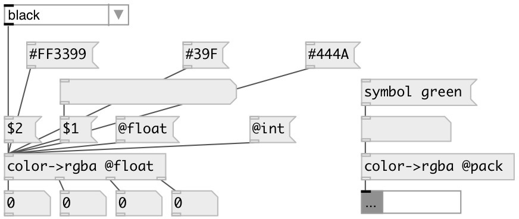

[index](index.html) :: [conv](category_conv.html)
---

# conv.color2rgba
**aliases:** [ceammc/color-&gt;rgba], [color-&gt;rgba]

###### convert named or hex color to separate RGBA values

*available since version:* 0.9.7

---

## information
Supported named colors are: black blue cyan gold gray green lime magenta navy olive orange pink purple red white yellow

## properties:

* **@pack** (initonly)
Get/set output as list to first outlet 
_type:_ flag 

* **@mode** 
Get/set output mode 
_type:_ symbol 
_enum:_ int, float 
_default:_ int 

* **@int** 
Get/set alias to @mode int. Output values in [0-255] range 
_type:_ alias 

* **@float** 
Get/set alias to @mode float. Output values in [0-1] range 
_type:_ alias 

## inlets:

* color name or hex value in full (#RRGGBB or #RRGGBBAA) or short (#RGB or #RGBA) format 
_type:_ control

## outlets:

* list if @pack flag specified or int[0-255] or float[0-1]: red channel value 
_type:_ control
* int[0-255] or float[0-1]: green channel value 
_type:_ control
* int[0-255] or float[0-1]: blue channel value 
_type:_ control
* int[0-255] or float[0-1]: alpha channel value 
_type:_ control

## keywords:

[conv](keywords/conv.html)
[color](keywords/color.html)
[hex](keywords/hex.html)
[rgb](keywords/rgb.html)
[rgba](keywords/rgba.html)

**Authors:** Serge Poltavsky

**License:** GPL3 or later

