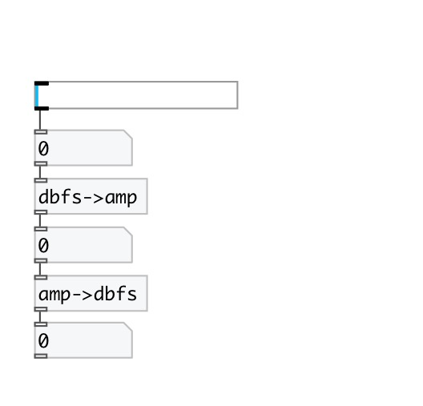

[< reference home](index.html)
---

# conv.dbfs2amp

convert decibel full scale to amplitude

---

Note: db values &lt;= -144 are converted to 0
 

---

---
arguments:

---
properties:

---
see also: 

