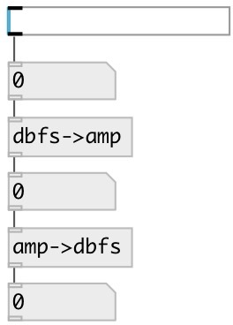

[index](index.html) :: [conv](category_conv.html)
---

# conv.dbfs2amp

###### convert decibel full scale to amplitude

*available since version:* 0.6

---

## information
Note: db values &lt;= -144 are converted to 0

## inlets:

* input value 
__type:__ control 

## outlets:

* converted value
__type:__ control 

## keywords:

[conv](keywords/conv.html)
[amp](keywords/amp.html)
[dbfs](keywords/dbfs.html)
[decibel](keywords/decibel.html)

**See also:**
[\[amp-&gt;dbfs\]](amp-%3Edbfs.html)

**Authors:** Serge Poltavsky

**License:** GPL3 or later

