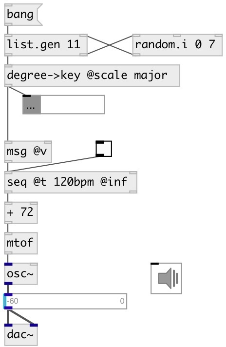

[index](index.html) :: [conv](category_conv.html)
---

# conv.degree2key
**aliases:** [ceammc/degree-&gt;key], [degree-&gt;key]

###### convert scale degree to key

*available since version:* 0.9.1

---

## information
Note: some scales are not for eq12 temperament

## arguments:

* **SCALE**
scale name 
_type:_ symbol 

## methods:

* **random**
choose random degree from current scale and convert it to key 

## properties:

* **@all** (readonly)
Get list all supported scales 
_type:_ list 
_default:_ aeolian ahirbhairav ajam atharKurd augmented augmented2 bartok bastanikar bayati bhairav chinese chromatic chromatic24 diminished diminished2 dorian egyptian enigmatic farahfaza gong hex_aeolian hex_dorian hex_major6 hex_major7 hex_phrygian hex_sus hijaz hijaz_desc hijaz_kar hindu hirajoshi husseini huzam indian ionian iraq iwato jiao jiharkah karjighar kijaz_kar_kurd kumoi kurd locrian lydian mahur major major_harmonic major_locrian major_melodic major_neapolitan major_pentatonic marva minor minor_harmonic minor_hungarian minor_lydian minor_melodic minor_melodic_desc minor_neapolitan minor_pentatonic minor_romanian mixolydian murassah mustar nahawand nahawand_desc nairuz nawa_athar nikriz partch_o1 partch_o2 partch_o3 partch_o4 partch_o5 partch_o6 partch_u1 partch_u2 partch_u3 partch_u4 partch_u5 partch_u6 pelog phrygian prometheus purvi rast rast_desc ritusen saba scriabin shang shawq_afza sikah sikah_desc spanish super_locrian suznak todi ushaq_mashri whole whole_leading yakah yakah_desc yu zamzam zanjaran zhi 

* **@scale** 
Get/set scale name 
_type:_ symbol 
_enum:_ aeolian, ahirbhairav, ajam, atharKurd, augmented, augmented2, bartok, bastanikar, bayati, bhairav, chinese, chromatic, chromatic24, diminished, diminished2, dorian, egyptian, enigmatic, farahfaza, gong, hex_aeolian, hex_dorian, hex_major6, hex_major7, hex_phrygian, hex_sus, hijaz, hijaz_desc, hijaz_kar, hindu, hirajoshi, husseini, huzam, indian, ionian, iraq, iwato, jiao, jiharkah, karjighar, kijaz_kar_kurd, kumoi, kurd, locrian, lydian, mahur, major, major_harmonic, major_locrian, major_melodic, major_neapolitan, major_pentatonic, marva, minor, minor_harmonic, minor_hungarian, minor_lydian, minor_melodic, minor_melodic_desc, minor_neapolitan, minor_pentatonic, minor_romanian, mixolydian, murassah, mustar, nahawand, nahawand_desc, nairuz, nawa_athar, nikriz, partch_o1, partch_o2, partch_o3, partch_o4, partch_o5, partch_o6, partch_u1, partch_u2, partch_u3, partch_u4, partch_u5, partch_u6, pelog, phrygian, prometheus, purvi, rast, rast_desc, ritusen, saba, scriabin, shang, shawq_afza, sikah, sikah_desc, spanish, super_locrian, suznak, todi, ushaq_mashri, whole, whole_leading, yakah, yakah_desc, yu, zamzam, zanjaran, zhi 
_default:_ major 

## inlets:

* input value 
_type:_ control

## outlets:

* float or float list: converted value(s) 
_type:_ control

## keywords:

[conv](keywords/conv.html)
[degree](keywords/degree.html)
[key](keywords/key.html)
[modus](keywords/modus.html)

**Authors:** Serge Poltavsky

**License:** GPL3 or later

