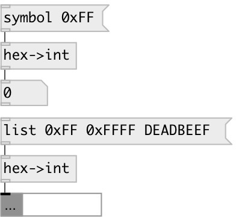

[index](index.html) :: [conv](category_conv.html)
---

# conv.hex2int

###### hex symbol to int value

*available since version:* 0.9.1

---

## properties:

* **@strict** 
Get/set ignore parsing error 
__type:__ flag 

## inlets:

* input value 
__type:__ control 

## outlets:

* converted value: int
__type:__ control 

## keywords:

[conv](keywords/conv.html)
[int](keywords/int.html)
[hex](keywords/hex.html)

**Authors:** Serge Poltavsky

**License:** GPL3 or later

