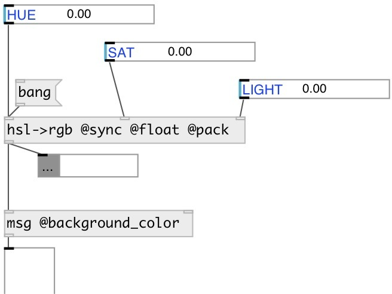

[index](index.html) :: [conv](category_conv.html)
---

# conv.hsl2rgb
**aliases:** [ceammc/hsl-&gt;rgb], [hsl-&gt;rgb]

###### convert HSL color values to RGB

*available since version:* 0.9.7

---

## properties:

* **@sync** (initonly)
Get/set output at any inlet change 
_type:_ flag 

* **@pack** (initonly)
Get/set output as list (creates single outlet object) 
_type:_ flag 

* **@mode** 
Get/set output mode 
_type:_ symbol 
_enum:_ int, float 
_default:_ int 

* **@int** 
Get/set alias to @mode int. Output integer values in [0-255] range 
_type:_ alias 

* **@float** 
Get/set alias to @mode float. Output float values in [0-1] range 
_type:_ alias 

## inlets:

* output current value 
_type:_ control
* set color saturation without output 
_type:_ control
* set color lightness without output 
_type:_ control

## outlets:

* list: R G B or red channel value (int[0-255] or float[0-1]) 
_type:_ control
* int[0-255] or float[0-1]: green channel value 
_type:_ control
* int[0-255] or float[0-1]: blue channel value 
_type:_ control

## keywords:

[conv](keywords/conv.html)
[color](keywords/color.html)
[hsl](keywords/hsl.html)
[rgb](keywords/rgb.html)

**Authors:** Serge Poltavsky

**License:** GPL3 or later

