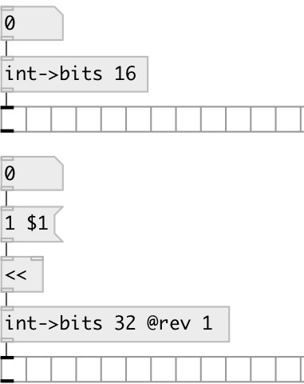

[index](index.html) :: [conv](category_conv.html)
---

# conv.int2bits

###### convert integer to list of bits

*available since version:* 0.9.1

---

## information
Note: negative numbers converted using machine architecture, commonly two&#39;s
            complement

## properties:

* **@size** 
Get/set output bit-length 
__type:__ int 
__range:__ 1..32 
__default:__ 32 

* **@rev** 
Get/set reversed bit order 
__type:__ int 
__enum:__ 0, 1 
__default:__ 0 

## inlets:

* input value 
__type:__ control 

## outlets:

* list of bits
__type:__ control 

## keywords:

[conv](keywords/conv.html)
[bits](keywords/bits.html)
[int](keywords/int.html)

**See also:**
[\[conv.bits2int\]](conv.bits2int.html)

**Authors:** Serge Poltavsky

**License:** GPL3 or later

