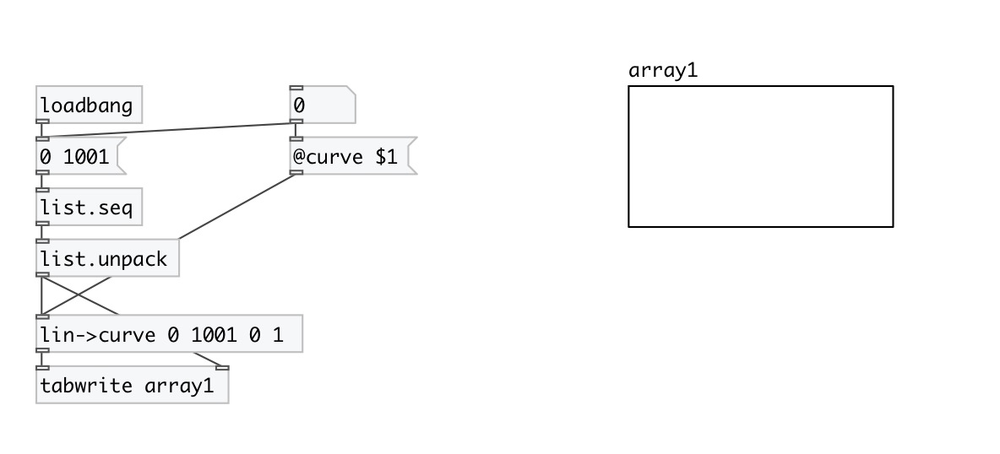
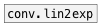

[< reference home](index.html)
---

# conv.lin2curve

map linear to exponential range with 0 allowed.

---

map the receiver from an assumed linear input range to an exponential curve output
            range. Unlike with [conv.lin2exp], the output range may include zero. If the input
            exceeds the input range, the following behaviours are specified by the clip
            property.
 

---

---
arguments:

FROM: begin of input range 
TO: end of input range 
FROM: begin of output range 
TO: end of output range 
CURVE: curve shape 

---
properties:

@in_from: begin of input range 
@in_to: end of input range 
@out_from: begin of output range 
@out_to: end of output range 
@curve: 0 (linear) &lt;0 (concave, negatively
            curved) &gt;0 (convex, positively curved) 
@clip: 
            noclip (don&#39;t clip) max (clip ceiling) min (clip floor) minmax (clip both). 
@noclip: alias to @clip noclip 
@min: alias to @clip min 
@max: alias to @clip max 
@minmax: alias to @clip minmax 

---
see also: 

