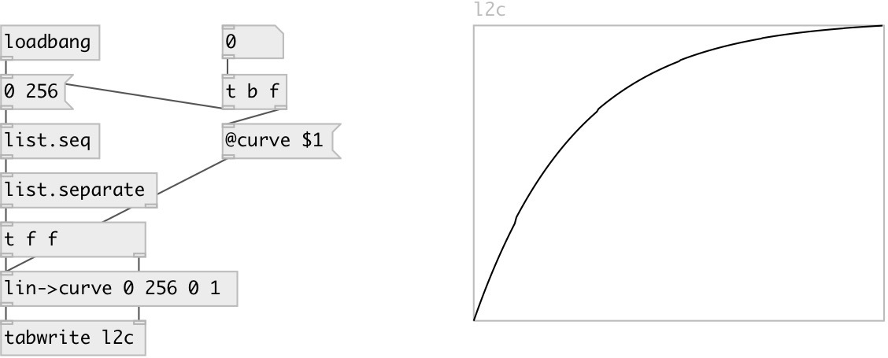

[index](index.html) :: [conv](category_conv.html)
---

# conv.lin2curve

###### map linear to exponential range with 0 allowed.

*available since version:* 0.1

---

## information
map the receiver from an assumed linear input range to an exponential curve output
            range. Unlike with [conv.lin2exp], the output range may include zero. If the input
            exceeds the input range, the following behaviours are specified by the clip
            property.

## arguments:

* **FROM**
begin of input range 
__type:__ float 

* **TO**
end of input range 
__type:__ float 

* **FROM**
begin of output range 
__type:__ float 

* **TO**
end of output range 
__type:__ float 

* **CURVE**
curve shape 
__type:__ float 

## properties:

* **@in_from** 
Get/set begin of input range 
__type:__ float 
__default:__ 0 

* **@in_to** 
Get/set end of input range 
__type:__ float 
__default:__ 127 

* **@out_from** 
Get/set begin of output range 
__type:__ float 
__default:__ 0 

* **@out_to** 
Get/set end of output range 
__type:__ float 
__default:__ 1 

* **@curve** 
Get/set 0 (linear) 0 (convex, positively curved) 
__type:__ float 
__default:__ -4 

* **@clip** 
Get/set noclip (don&#39;t clip) max (clip ceiling) min (clip floor) minmax (clip both). 
__type:__ symbol 
__enum:__ noclip, min, max, minmax 
__default:__ minmax 

* **@noclip** 
Get/set alias to @clip noclip 
__type:__ symbol 

* **@min** 
Get/set alias to @clip min 
__type:__ symbol 

* **@max** 
Get/set alias to @clip max 
__type:__ symbol 

* **@minmax** 
Get/set alias to @clip minmax 
__type:__ symbol 

## inlets:

* input value 
__type:__ control 

## outlets:

* converted value
__type:__ control 

## keywords:

[convert](keywords/convert.html)
[exponential](keywords/exponential.html)
[curve](keywords/curve.html)

**See also:**
[\[conv.lin2exp\]](conv.lin2exp.html)

**Authors:** Serge Poltavsky

**License:** GPL3 or later

