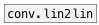
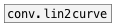

[<<< reference home](ceammc_lib.md)
---

# conv.lin2exp

```


[0 1001(                            [array array1 size=1000 yr=0..1]
|
[list.seq]
|
[list.separate            ]
|                         |
[lin->exp 0 1001 0.01 1]  |
|                         |.
[tabwrite            array1]


            
```
---
maps linear range to exponential range
---
arguments:

FROM: begin of input range<br>
TO: end of input range<br>
FROM: begin of output range<br>
TO: end of input output<br>

---
properties:

@in_from: begin of input range<br>
@in_to: end of input range<br>
@out_from: begin of output range<br>
@out_to: end of output range<br>
@clip: 
            noclip (don&#39;t clip) max (clip ceiling) min (clip floor) minmax (clip both).<br>
@noclip: alias to @clip noclip<br>
@min: alias to @clip min<br>
@max: alias to @clip max<br>
@minmax: alias to @clip minmax<br>

---
see also:<br>
[](conv.lin2lin.md)
[](conv.lin2curve.md)
