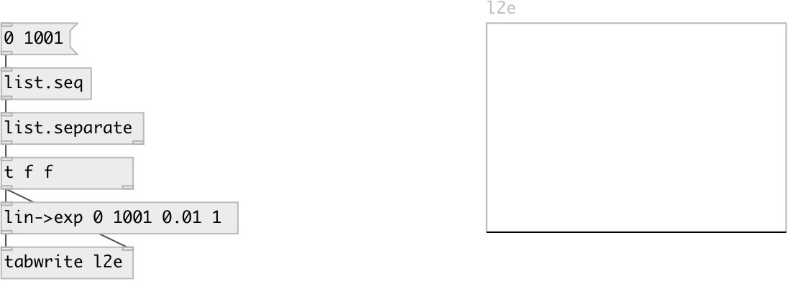

[index](index.html) :: [conv](category_conv.html)
---

# conv.lin2exp
**aliases:** [ceammc/lin-&gt;exp], [lin-&gt;exp]

###### maps linear range to exponential range

*available since version:* 0.1

---

## information
The output range must not include zero. If the input exceeds the input range, by default clip is applied.

## arguments:

* **FROM**
begin of input range 
_type:_ float 

* **TO**
end of input range 
_type:_ float 

* **FROM**
begin of output range 
_type:_ float 

* **TO**
end of input output 
_type:_ float 

## properties:

* **@in_from** 
Get/set begin of input range 
_type:_ float 
_default:_ 0 

* **@in_to** 
Get/set end of input range 
_type:_ float 
_default:_ 127 

* **@out_from** 
Get/set begin of output range 
_type:_ float 
_default:_ 0.01 

* **@out_to** 
Get/set end of output range 
_type:_ float 
_default:_ 1 

* **@clip** 
Get/set noclip (don&#39;t clip) max (clip ceiling) min (clip floor) minmax (clip both). 
_type:_ symbol 
_enum:_ noclip, min, max, minmax 
_default:_ minmax 

* **@noclip** 
Get/set alias to @clip noclip 
_type:_ symbol 

* **@min** 
Get/set alias to @clip min 
_type:_ symbol 

* **@max** 
Get/set alias to @clip max 
_type:_ symbol 

* **@minmax** 
Get/set alias to @clip minmax 
_type:_ symbol 

## inlets:

* input value 
_type:_ control

## outlets:

* converted value 
_type:_ control

## keywords:

[convert](keywords/convert.html)
[exponential](keywords/exponential.html)

**See also:**
[\[conv.lin2lin\]](conv.lin2lin.html)
[\[conv.lin2curve\]](conv.lin2curve.html)

**Authors:** Serge Poltavsky

**License:** GPL3 or later

