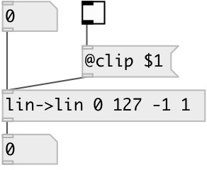

[index](index.html) :: [conv](category_conv.html)
---

# conv.lin2lin
**aliases:** [ceammc/lin-&gt;lin], [lin-&gt;lin], [ceammc/l-&gt;l], [l-&gt;l]

###### converts from the one linear range into another

*available since version:* 0.1

---

## arguments:

* **IN_FROM**
begin of input range 
_type:_ float 

* **IN_TO**
end of input range 
_type:_ float 

* **OUT_FROM**
begin of output range 
_type:_ float 

* **OUT_TO**
end of input output 
_type:_ float 

## properties:

* **@clip** 
Get/set noclip (don&#39;t clip) max (clip ceiling) min (clip floor) minmax (clip both). 
_type:_ symbol 
_enum:_ noclip, min, max, minmax 
_default:_ minmax 

* **@in_from** 
Get/set begin of input range 
_type:_ float 
_default:_ 0 

* **@in_to** 
Get/set end of input range 
_type:_ float 
_default:_ 127 

* **@max** 
Get/set alias to @clip max 
_type:_ alias 

* **@min** 
Get/set alias to @clip min 
_type:_ alias 

* **@minmax** 
Get/set alias to @clip minmax 
_type:_ alias 

* **@noclip** 
Get/set alias to @clip noclip 
_type:_ alias 

* **@out_from** 
Get/set begin of output range 
_type:_ float 
_default:_ 0 

* **@out_to** 
Get/set end of output range 
_type:_ float 
_default:_ 1 

## inlets:

* input float 
_type:_ control

## outlets:

* converted float/list 
_type:_ control

## keywords:

[convert](keywords/convert.html)
[linear](keywords/linear.html)

**See also:**
[\[conv.cc2amp\]](conv.cc2amp.html)

**Authors:** Serge Poltavsky

**License:** GPL3 or later

