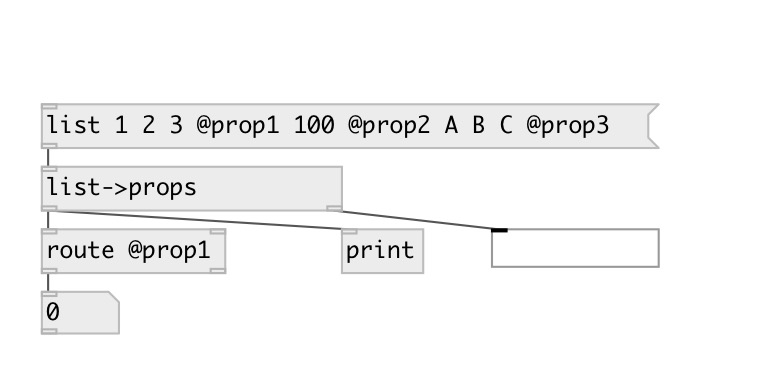

[index](index.html) :: [conv](category_conv.html)
---

# conv.list2props

###### converts list to series of property messages

*available since version:* 0.7

---

## inlets:

* list of properties 
__type:__ control 

## outlets:

* sequence of @prop messages
__type:__ control 
* list of non prop arguments
__type:__ control 

## keywords:

[conv](keywords/conv.html)
[properties](keywords/properties.html)

**Authors:** Serge Poltavsky

**License:** GPL3 or later

