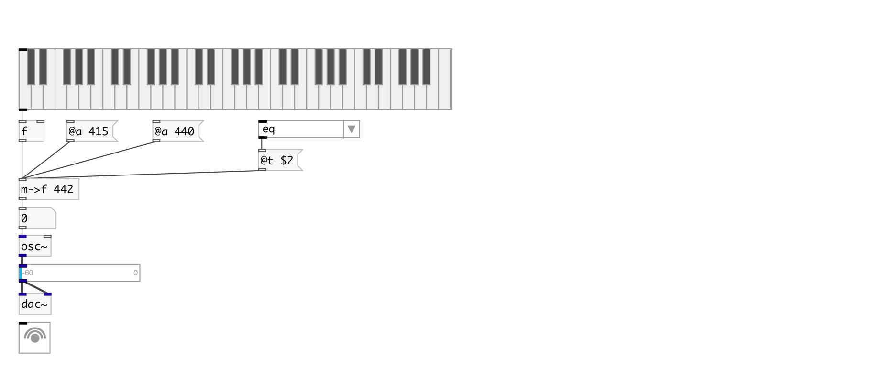
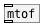

[< reference home](index.html)
---

# conv.midi2freq

convert from midi pitch to frequency in hz (with various base A and
            temperament)

---

 

---

---
arguments:

APITCH: pitch
            standard 

---
properties:

@a(Hz): A pitch frequency 
@t: 
            temperament 

---
see also: 

