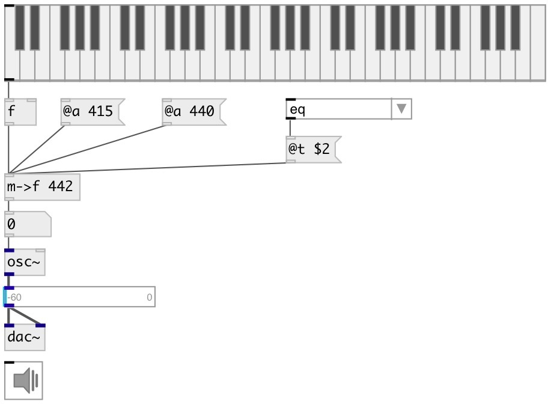

[index](index.html) :: [conv](category_conv.html)
---

# conv.midi2freq

###### convert from midi pitch to frequency in hz (with various base A and temperament)

*available since version:* 0.6

---

## arguments:

* **APITCH**
pitch standard 
_type:_ float 

## properties:

* **@a** 
Get/set A pitch frequency 
_type:_ float 
_units:_ Hz 
_range:_ 200..600 
_default:_ 440 

* **@t** 
Get/set temperament 
_type:_ symbol 
_enum:_ eq, just, ganassi, meantone, kirnberger3, pythagorean, rameau, valotti, zarlino 
_default:_ eq 

## inlets:

* input MIDI pitch 
_type:_ control

## outlets:

* converted value 
_type:_ control

## keywords:

[conv](keywords/conv.html)
[freq](keywords/freq.html)
[midi](keywords/midi.html)

**See also:**
[\[mtof\]](mtof.html)

**Authors:** Serge Poltavsky

**License:** GPL3 or later

