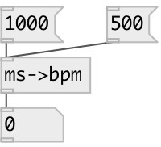

[index](index.html) :: [conv](category_conv.html)
---

# conv.ms2bpm
**aliases:** [ceammc/ms-&gt;bpm], [ms-&gt;bpm]

###### convert period in milliseconds to frequency in BPM

*available since version:* 0.9.11

---

## inlets:

* period in milliseconds 
_type:_ control

## outlets:

* bpm frequency 
_type:_ control

## keywords:

[conv](keywords/conv.html)
[time](keywords/time.html)

**See also:**
[\[conv.bpm2sec\]](conv.bpm2sec.html)
[\[conv.sec2bpm\]](conv.sec2bpm.html)

**Authors:** Serge Poltavsky

**License:** GPL3 or later

