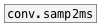

[< reference home](index.html)
---

# conv.ms2samp


convert time in milliseconds to number of samples according to current
            samplerate

---

<br>


---


```


[F digits=10]
|
[ms->samp]
|
[F digits=10]

            
```

---
arguments:


---
properties:


---
see also:<br>
[](conv.samp2ms.html)
