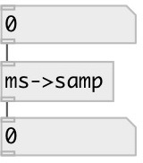

[index](index.html) :: [conv](category_conv.html)
---

# conv.ms2samp

###### convert time in milliseconds to number of samples according to current
            samplerate

*available since version:* 0.2

---

## inlets:

* time in milliseconds 
_type:_ control

## outlets:

* converted value (float or list) 
_type:_ control

## keywords:

[conv](keywords/conv.html)
[samp](keywords/samp.html)
[ms](keywords/ms.html)

**See also:**
[\[conv.samp2ms\]](conv.samp2ms.html)

**Authors:** Serge Poltavsky

**License:** GPL3 or later

