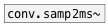

[< reference home](ceammc_lib.html)
---

# conv.ms2samp~


convert time in milliseconds to number of samples according to current
            samplerate

```


[bang(
|
[plot.linspace~ 0 1000]
|                    ^|
[ms->samp~]           |
|                     |.
[ui.plot~ @size 400 170 @xlabels 1 @ylabels 1 @ymin 0 @ymax 1000 @yauto 1 @ymin_ticks 0]


[ui.dsp~]

            
```

---
arguments:


---
properties:


---
see also:<br>
[](conv.samp2ms~.html)
