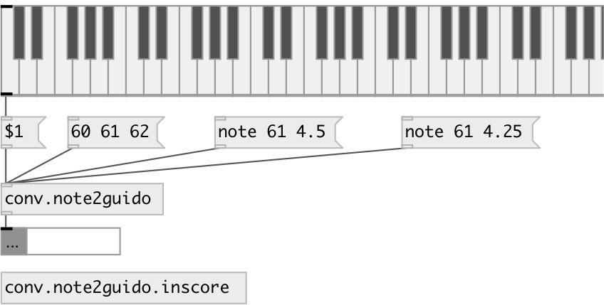

[index](index.html) :: [conv](category_conv.html)
---

# conv.note2guido
**aliases:** [ceammc/note-&gt;guido], [note-&gt;guido]

###### convert MIDI note to Guido notation

*available since version:* 0.9.5

---

## methods:

* **note**
 
  __parameters:__
  - **PITCH** note pitch (pitch &lt;0 treated as rest) 
    type: int  
    required: True  

  - **DUR** note duration 
    type: float  
    required: True  

## inlets:

* pitch 
_type:_ control

## outlets:

* symbol: converted value 
_type:_ control

## keywords:

[conv](keywords/conv.html)
[guido](keywords/guido.html)
[midi](keywords/midi.html)

**See also:**
[\[proto.inscore\]](proto.inscore.html)

**Authors:** Serge Poltavsky

**License:** GPL3 or later

