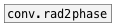

[< reference home](index.html)
---

# conv.phase2rad


convert phase value [0-1] to radians [0-2π]

---

<br>


---


```


[ui.knob]
|
|
|
[F]
|
[phase->rad]
|
[F]
|
[rad->phase]
|
[ui.knob]

            
```

---
arguments:


---
properties:


---
see also:<br>
[](conv.rad2phase.html)
