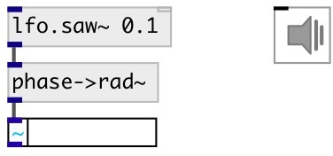

[index](index.html) :: [conv](category_conv.html)
---

# conv.phase2rad~

###### convert phase value [0-1] to radians [0-2π]

*available since version:* 0.8

---

## inlets:

* input value 
__type:__ audio 

## outlets:

* converted value
__type:__ audio 

## keywords:

[conv](keywords/conv.html)
[phase](keywords/phase.html)
[radians](keywords/radians.html)

**See also:**
[\[conv.rad2phase~\]](conv.rad2phase~.html)

**Authors:** Serge Poltavsky

**License:** GPL3 or later

