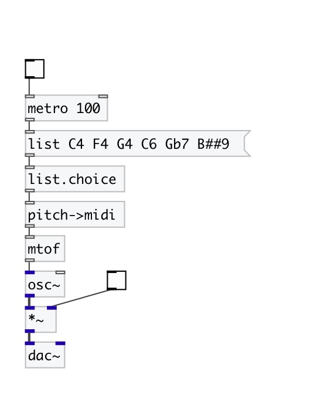

[< reference home](index.html)
---

# conv.pitch2midi

converts symbol pitch name to MIDI note number

---

Convert Scientific Pitch Notation to MIDI note numbers. SPN consist of pitch class
            (C, C#, D, Eb etc.) and octave (0-9). C4 is middle C (MIDI: 60)
 

---

---
arguments:

---
properties:

