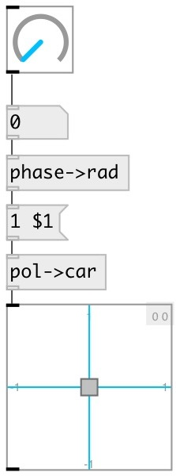

[index](index.html) :: [conv](category_conv.html)
---

# conv.pol2car

###### convert from polar coordinates to cartesian

*available since version:* 0.8

---

## inlets:

* radius and angle (in radians) pair 
_type:_ control

## outlets:

* x, y coordinates pair 
_type:_ control

## keywords:

[conv](keywords/conv.html)
[polar](keywords/polar.html)
[cartesian](keywords/cartesian.html)

**See also:**
[\[conv.car2pol\]](conv.car2pol.html)

**Authors:** Serge Poltavsky

**License:** GPL3 or later

