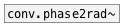

[< reference home](index.html)
---

# conv.rad2phase~


convert radians value to phase

---

<br>


---


```


[lfo.saw~ 0.1]  [ui.dsp~]
|
[phase->rad~]
|
[rad->phase~]
|
[ui.scope~]

            
```

---
arguments:


---
properties:


---
see also:<br>
[](conv.phase2rad~.html)
