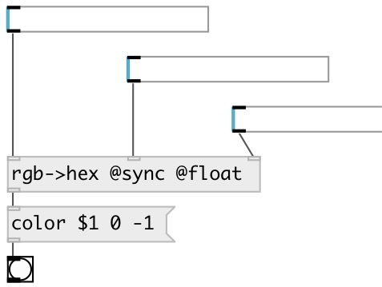

[index](index.html) :: [conv](category_conv.html)
---

# conv.rgb2hex
**aliases:** [ceammc/rgb-&gt;hex], [rgb-&gt;hex]

###### convert separate RGB values to hex color

*available since version:* 0.9.7

---

## properties:

* **@mode** 
Get/set input mode 
_type:_ symbol 
_enum:_ int, float 
_default:_ int 

* **@int** 
Get/set alias to @mode int. Expected input values are in [0-255] range 
_type:_ alias 

* **@float** 
Get/set alias to @mode float. Expected input values are in [0-1] range 
_type:_ alias 

* **@sync** (initonly)
Get/set output value on any inlet change 
_type:_ flag 

## inlets:

* red channel value in [0-255] range 
_type:_ control
* green channel value in [0-255] range 
_type:_ control
* blue channel value in [0-255] range 
_type:_ control

## outlets:

* symbol: #RRGGBB color value 
_type:_ control

## keywords:

[conv](keywords/conv.html)
[color](keywords/color.html)
[hex](keywords/hex.html)
[rgb](keywords/rgb.html)
[rgba](keywords/rgba.html)

**Authors:** Serge Poltavsky

**License:** GPL3 or later

