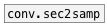

[<<< reference home](ceammc_lib.md)
---

# conv.samp2ms

```


[44100(  [20 1000 5000 20000(
|        |
[samp->ms]
|
[F digits=10]

            
```
---
convert samples to time according to samplerate
---
arguments:


---
properties:


---
see also:<br>
[](conv.sec2samp.md)
