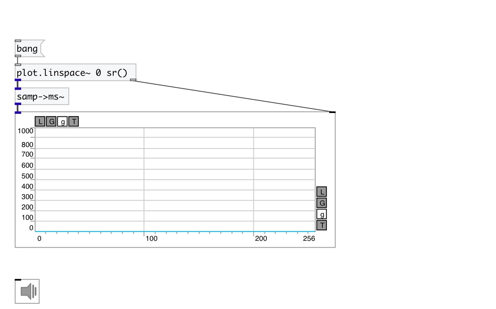

[index](index.html) :: [conv](category_conv.html)
---

# conv.samp2ms~
**aliases:** [ceammc/samp-&gt;ms\~], [samp-&gt;ms\~]

###### convert samples to milliseconds according to samplerate

*available since version:* 0.9

---

## inlets:

* input signal 
_type:_ audio

## outlets:

* output signal 
_type:_ audio

## keywords:

[conv](keywords/conv.html)
[samp](keywords/samp.html)

**See also:**
[\[conv.samp2ms~\]](conv.samp2ms~.html)

**Authors:** Serge Poltavsky

**License:** GPL3 or later

