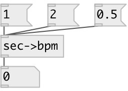

[index](index.html) :: [conv](category_conv.html)
---

# conv.sec2bpm

###### convert period in seconds to frequency in BPM

*available since version:* 0.9.1

---

## inlets:

* period in seconds 
__type:__ control 

## outlets:

* bpm frequency
__type:__ control 

## keywords:

[conv](keywords/conv.html)
[time](keywords/time.html)

**See also:**
[\[conv.bpm2sec\]](conv.bpm2sec.html)
[\[conv.ms2bpm\]](conv.ms2bpm.html)

**Authors:** Serge Poltavsky

**License:** GPL3 or later

