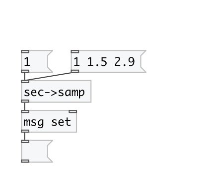
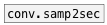

[< reference home](index.html)
---

# conv.sec2samp

convert time in seconds to number of samples according to current
            samplerate

---

 

---

---
arguments:

---
properties:

---
see also: 

