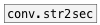

[<<< reference home](ceammc_lib.md)
---

# conv.sec2str

```


[T]                   [F]
|                     |
[metro 1000]          [sec->str @symbol @ms]
|                     |
[f] X [+ 1]           [S digits=14]
|                     |
[sec->str @symbol]    [str->sec]
|                     |
[S digits=12]         [F]

            
```
---
converts float time in seconds to formated symbol (or
            string)
---
arguments:


---
properties:

@ms: output milliseconds<br>
@symbol: if specified - output formatted time as symbol,
            otherwise as string.<br>

---
see also:<br>
[](conv.str2sec.md)
