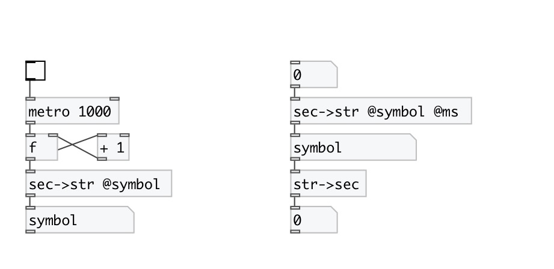

[< reference home](index.html)
---

# conv.sec2str

converts float time in seconds to formated symbol (or
            string)

---

 

---

---
arguments:

---
properties:

@ms: output milliseconds 
@symbol: if specified - output formatted time as symbol,
            otherwise as string. 

---
see also: 

