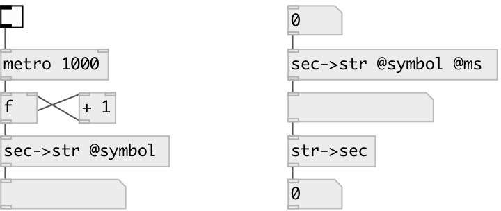

[index](index.html) :: [conv](category_conv.html)
---

# conv.sec2str

###### converts float time in seconds to formated symbol (or string)

*available since version:* 0.1

---

## properties:

* **@ms** 
Get/set output milliseconds 
_type:_ flag 
_default:_ 0 

* **@symbol** 
Get/set if specified - output formatted time as symbol, otherwise as string. 
_type:_ flag 
_default:_ 0 

## inlets:

* converts float value in seconds to formatted symbol 
_type:_ control

## outlets:

* time in format &#34;HH:MM::SS&#34; or &#34;HH:MM:SS.XXX&#34; 
_type:_ control

## keywords:

[conv](keywords/conv.html)
[time](keywords/time.html)

**See also:**
[\[conv.str2sec\]](conv.str2sec.html)

**Authors:** Serge Poltavsky

**License:** GPL3 or later

