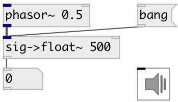

[index](index.html) :: [conv](category_conv.html)
---

# conv.sig2float~

###### convert signal to floats

*available since version:* 0.9.2

---

## information
convert signal to float via specified time invervals

## arguments:

* **INTERV**
sampling interval 
_type:_ float 

## properties:

* **@interval** 
Get/set sampling interval 
_type:_ float 
_units:_ ms 
_min value:_ -1 
_default:_ 50 

* **@offset** 
Get/set sample offset inside DSP block 
_type:_ int 
_units:_ samp 
_range:_ 0..8192 
_default:_ 0 

## inlets:

* input signal 
_type:_ audio

## outlets:

* float: sample 
_type:_ control

## keywords:

[conv](keywords/conv.html)
[signal](keywords/signal.html)
[float](keywords/float.html)
[snapshot](keywords/snapshot.html)

**See also:**
[\[snapshot~\]](snapshot~.html)

**Authors:** Serge Poltavsky

**License:** GPL3 or later

