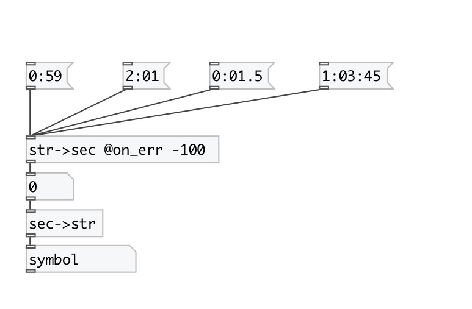
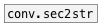

[< reference home](index.html)
---

# conv.str2sec

converts formatted time to float value in seconds

---

 

---

---
arguments:

---
properties:

@on_err: value returned when unrecognized
            symbol given 

---
see also: 

