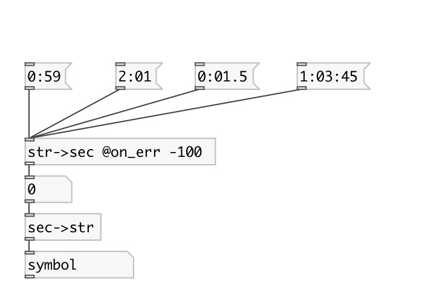

[index](index.html) :: [conv](category_conv.html)
---

# conv.str2sec

###### converts formatted time to float value in seconds

*available since version:* 0.1

---

## properties:

* **@on_err** 
Get/set value returned when unrecognized symbol given 
_type:_ float 
_default:_ -1 

## inlets:

* Time in format: &#34;HH:MM::SS[.XXX]&#34; 
_type:_ control

## outlets:

* time in seconds 
_type:_ control

## keywords:

[conv](keywords/conv.html)
[time](keywords/time.html)

**See also:**
[\[conv.sec2str\]](conv.sec2str.html)

**Authors:** Serge Poltavsky

**License:** GPL3 or later

