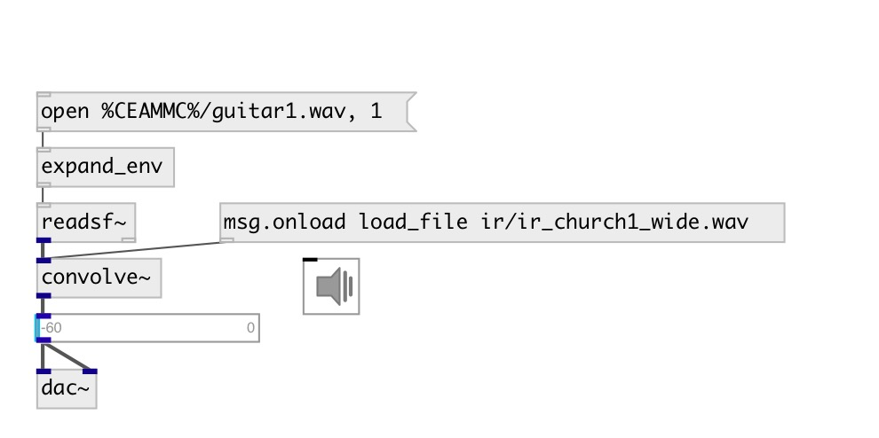

[index](index.html) :: [base](category_base.html)
---

# convolve~
**aliases:** [ceammc/convolve\~]

###### realtime FFT convolution

*available since version:* 0.9.7

---

## methods:

* **load_file**
load IR from specified file (resamples if required from file samplerate to
runtime samplerate) 
  __parameters:__
  - **FILE** file name, relative or absolute 
    type: atom  
    required: True  

* **load_array**
load IR from array 
  __parameters:__
  - **ARRAY** array name 
    type: symbol  
    required: True  

* **set**
set IR from list 
  __parameters:__
  - **LIST** IR data 
    type: float  
    required: True  

## properties:

* **@offset** 
Get/set impulse response (IR) offset 
_type:_ int 
_units:_ samp 
_min value:_ 0 
_default:_ 0 

* **@maxsize** 
Get/set max impulse response size 
_type:_ int 
_units:_ samp 
_range:_ 0..300000 
_default:_ 50000 

* **@norm** 
Get/set normalize impulse response 
_type:_ bool 
_default:_ 1 

## inlets:

* input signal 
_type:_ audio

## outlets:

* output signal 
_type:_ audio

## keywords:

[fft](keywords/fft.html)
[convolution](keywords/convolution.html)
[IR](keywords/IR.html)
[impulse](keywords/impulse.html)
[response](keywords/response.html)

**Authors:** Serge Poltavsky

**License:** GPL3 or later

