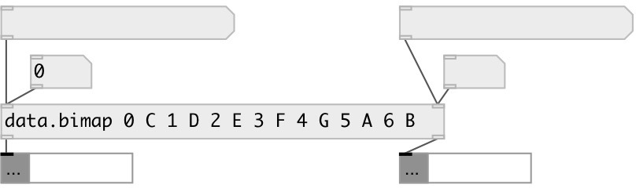

[index](index.html) :: [data](category_data.html)
---

# data.bimap
**aliases:** [ceammc/bimap], [bimap]

###### bidirectional map container

*available since version:* 0.9.7

---

## information
NOTE: all object inlets are &#39;hot&#39;

## arguments:

* **VALUE**
initial value, list of pairs: LEFT_KEY1 RIGHT_KEY1 LEFT_KEY2 RIGHT_KEY2 etc. 
_type:_ list 

## methods:

* **clear**
clear bidirectional map content 

* **insert**
insert new left-right map entry 
  __parameters:__
  - **PAIR** list: LEFT_KEY RIGHT_KEY 
    type: list  
    required: True  

* **read**
read bimap from JSON file. Array of array pairs expected. 
  __parameters:__
  - **FNAME** path to file, absolute or relative 
    type: symbol  
    required: True  

* **set**
set bidirectional map content 
  __parameters:__
  - **DATA** new value list 
    type: list  
    required: True  

* **write**
write to JSON file, to overwrite existing file use @force flag 
  __parameters:__
  - **FNAME** path to file, absolute or relative 
    type: symbol  
    required: True  

  - **[@force]** force flag to overwrite existing files 
    type: symbol  

## properties:

* **@value** 
Get/set value, list of pairs: LEFT_KEY1 RIGHT_KEY1 LEFT_KEY2 RIGHT_KEY2 etc. 
_type:_ list 

* **@size** (readonly)
Get number of left-right pairs in map 
_type:_ int 
_default:_ 0 

* **@empty** (readonly)
Get true if empty 
_type:_ bool 
_default:_ 1 

* **@keys_left** (readonly)
Get list of left map keys 
_type:_ list 

* **@keys_right** (readonly)
Get list of right map keys 
_type:_ list 

## inlets:

* try to find left key in the map and output the right value on success 
_type:_ control
* try to find right key in the map and output the left value on success 
_type:_ control

## outlets:

* atom or list: right value output 
_type:_ control
* atom or list: left value output 
_type:_ control

## keywords:

[data](keywords/data.html)
[map](keywords/map.html)
[container](keywords/container.html)
[bidirectional](keywords/bidirectional.html)

**Authors:** Serge Poltavsky

**License:** GPL3 or later

