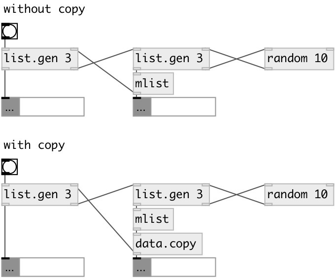

[index](index.html) :: [data](category_data.html)
---

# data.copy

###### make copy for any data types: MList, Set etc...

*available since version:* 0.9.2

---

## information
Data types, such as MList, are passed by reference, not by value.

## inlets:

* input data 
_type:_ control

## outlets:

* data copy 
_type:_ control

## keywords:

[data](keywords/data.html)
[copy](keywords/copy.html)

**Authors:** Serge Poltavsky

**License:** GPL3 or later

