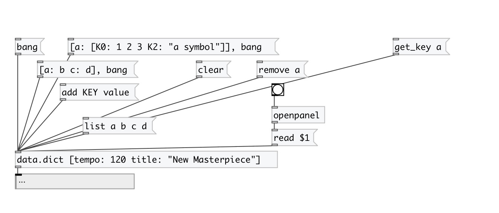

[< reference home](index.html)
---

# data.dict

dictionary container: store values by key

---

Syntax: [key1: value key2 : &#34;with space&#34;]. Nested dictionaries are supported: [a:
            [A:1 B:2]]).
 

---

---
arguments:

---
properties:

@keys: keys of dictionary 
@empty: 1 if dict is
            empty, otherwise 0 
@size: number of
            entries in dictionary 

---
see also: 

