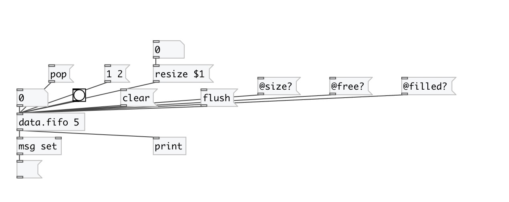

[< reference home](index.html)
---

# data.fifo

First-In-First-Out (FIFO) queue data container

---

If size argument specified - creates queue with fixed size. When count of values
            exceed this limit, outputs and removes first value in queue.
 

---

---
arguments:

size: if specified, creates fixed-size queue.
            Value &#39;0&#39; means default size (1024) 

---
properties:

@empty: if queue is
            empty 
@filled: current
            number of elements in queue 
@size: size of
            queue 
@free: number of
            elements you can add to queue until it full 

---
see also: 

