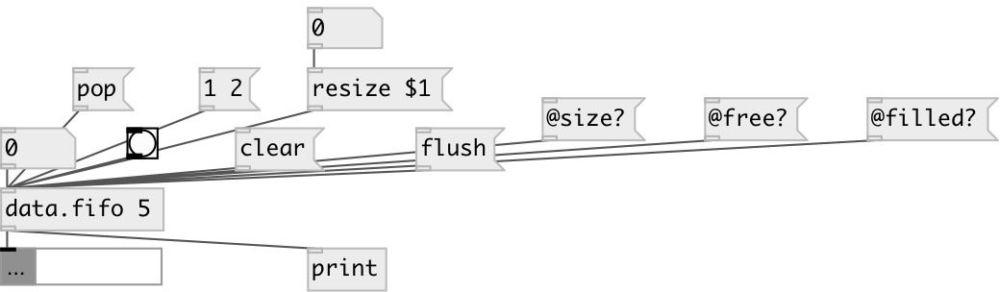

[index](index.html) :: [data](category_data.html)
---

# data.fifo

###### First-In-First-Out (FIFO) queue data container

*available since version:* 0.1

---

## information
If size argument specified - creates queue with fixed size. When count of values
            exceed this limit, outputs and removes first value in queue.

## arguments:

* **size**
if specified, creates fixed-size queue. Value &#39;0&#39; means default size (1024) 
_type:_ int 

## methods:

* **clear**
removes all queue values 

* **flush**
outputs and removes all queue values 

* **pop**
outputs and removes first values in queue 

* **resize**
 
  __parameters:__
  - **[anonym]** changes queue size. All previous values (if any) are silently removed 
    type: int  

## properties:

* **@empty** (readonly)
Get if queue is empty 
_type:_ int 
_enum:_ 0, 1 
_default:_ 1 

* **@filled** (readonly)
Get current number of elements in queue 
_type:_ int 
_min value:_ 0 
_default:_ 0 

* **@size** 
Get/set size of queue 
_type:_ int 
_range:_ 1..1024 
_default:_ 32 

* **@free** (readonly)
Get number of elements you can add to queue until it full 
_type:_ int 
_min value:_ 0 
_default:_ 32 

## inlets:

* same as *flush* message 
_type:_ control

## outlets:

* output value 
_type:_ control

## keywords:

[data](keywords/data.html)
[fifo](keywords/fifo.html)

**See also:**
[\[data.list\]](data.list.html)

**Authors:** Serge Poltavsky

**License:** GPL3 or later

