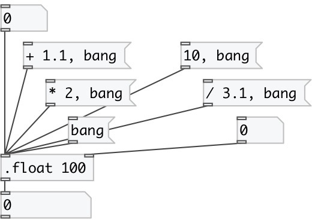

[index](index.html) :: [data](category_data.html)
---

# data.float
**aliases:** [.float], [.f]

###### robust float object

*available since version:* 0.6

---

## arguments:

* **VALUE**
set initial value 
_type:_ float 

## methods:

* **set**
sets new value without output 

* **+**
add to float, no output 

* **-**
subtract from float, no output 

* *****
multiply to, no output 

* **/**
divide by, no output 

## properties:

* **@value** (readonly)
Get current value 
_type:_ float 
_default:_ 0 

## inlets:

* output value 
_type:_ control
* set new value without output 
_type:_ control

## outlets:

* set output 
_type:_ control

## keywords:

[data](keywords/data.html)
[float](keywords/float.html)

**See also:**
[\[data.int\]](data.int.html)

**Authors:** Serge Poltavsky

**License:** GPL3 or later

