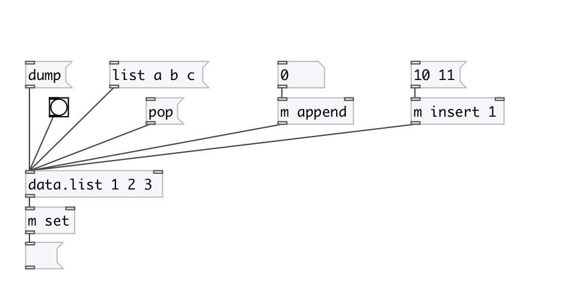
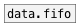

[< reference home](index.html)
---

# data.list

list container

---

 

---

---
arguments:

X: initial list values 

---
properties:

@empty: 1 if list is
            empty, otherwise 0 
@size: number of
            elements in list 

---
see also: 

