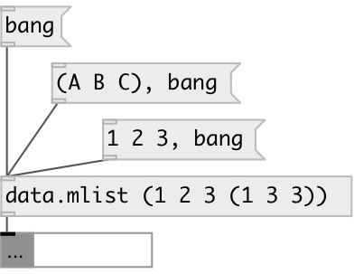

[index](index.html) :: [data](category_data.html)
---

# data.mlist

###### multidimensional list container

*available since version:* 0.6

---

## information
Syntax: values are separated by spaces: (1 2 3) - list of 1, 2 and 3
Nested lists: (1 2 3 (nested liat values))
Symbols with spaces: (&#34;single item list&#34;)

## arguments:

* **X**
initial list values in (). For example: (1 2 3 (1 2) 4) 
__type:__ any 

## methods:

* **append**
adds values to the end of the list 
  __parameters:__
  - **VAL** appended value 
    type: atom  
    required: True  

* **prepend**
inserts values to the list beginning 
  __parameters:__
  - **VAL** prepended value 
    type: atom  
    required: True  

* **insert**
inserts values to the specified position 
  __parameters:__
  - **IDX** insert position 
    type: int  
    required: True  

  - **VAL** value 
    type: atom  
    required: True  

* **fill**
fills with specified value 
  __parameters:__
  - **VAL** fill value 
    type: atom  
    required: True  

* **reverse**
reverses list 

* **choose**
choose random element in list and output it 

* **shuffle**
put elements in random order 

* **sort**
sorts list 

* **clear**
removes all list elements 

* **pop**
removes last list element 

* **remove**
removes specified element 
  __parameters:__
  - **IDX** element index 
    type: int  
    required: True  

* **set**
sets new list without output 
  __parameters:__
  - **LIST** new list content 
    type: list  
    required: True  

* **dump**
dump object info to Pd window 

* **(....)**
sets new list without output 

## properties:

* **@empty** (readonly)
Get 1 if list is empty, otherwise 0 
__type:__ int 
__enum:__ 0, 1 
__default:__ 1 

* **@size** (readonly)
Get number of elements in list 
__type:__ int 
__min value:__ 0 
__default:__ 0 

## inlets:

* output current list value 
__type:__ control 

## outlets:

* output list or list elements
__type:__ control 

## keywords:

[data](keywords/data.html)
[multilist](keywords/multilist.html)

**See also:**
[\[data.list\]](data.list.html)

**Authors:** Serge Poltavsky

**License:** GPL3 or later

