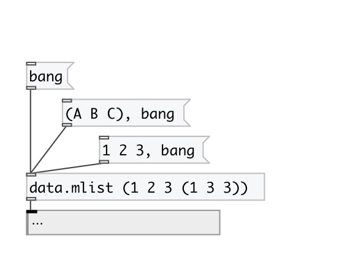

[< reference home](index.html)
---

# data.mlist

multidimensional list container

---

Syntax: values are separated by spaces: (1 2 3) - list of 1, 2 and 3
Nested lists: (1 2 3 (nested liat values))
Symbols with spaces: (&#34;single item list&#34;)
 

---

---
arguments:

X: initial list values in (). For example: (1 2 3 (1 2)
            4) 

---
properties:

@empty: 1 if list is
            empty, otherwise 0 
@size: number of
            elements in list 

---
see also: 

