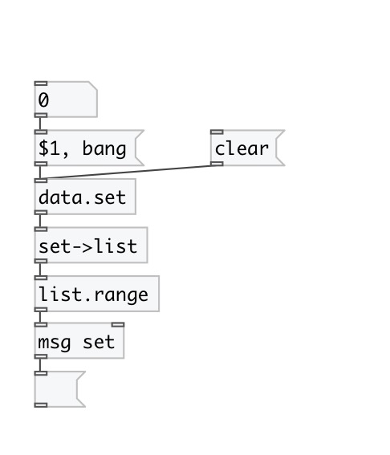

[< reference home](index.html)
---

# data.set

container that store unique elements

---

 

---

---
arguments:

X: set elements 

---
properties:

@empty: 1 if list is
            empty, otherwise 0 
@size: number of
            elements in list 

---
see also: 

