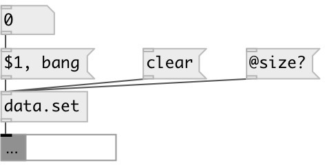

[index](index.html) :: [data](category_data.html)
---

# data.set

###### container that store unique elements

*available since version:* 0.3

---

## arguments:

* **X**
set elements 
_type:_ any 

## methods:

* **add**
add values to the set 
  __parameters:__
  - **VAL** added values 
    type: list  
    required: True  

* **clear**
removes all set elements 

* **remove**
remove elements from the set 
  __parameters:__
  - **VAL** elements 
    type: list  
    required: True  

* **set**
sets new set content without output 
  __parameters:__
  - **LIST** new set content 
    type: list  
    required: True  

## properties:

* **@empty** (readonly)
Get 1 if list is empty, otherwise 0 
_type:_ int 
_enum:_ 0, 1 
_default:_ 1 

* **@size** (readonly)
Get number of elements in list 
_type:_ int 
_min value:_ 0 
_default:_ 0 

* **@value** 
Get/set current value 
_type:_ list 

## inlets:

* output set content 
_type:_ control

## outlets:

* set output 
_type:_ control

## keywords:

[data](keywords/data.html)
[set](keywords/set.html)

**See also:**
[\[set-&gt;list\]](set-%3Elist.html)
[\[data.list\]](data.list.html)

**Authors:** Serge Poltavsky

**License:** GPL3 or later

