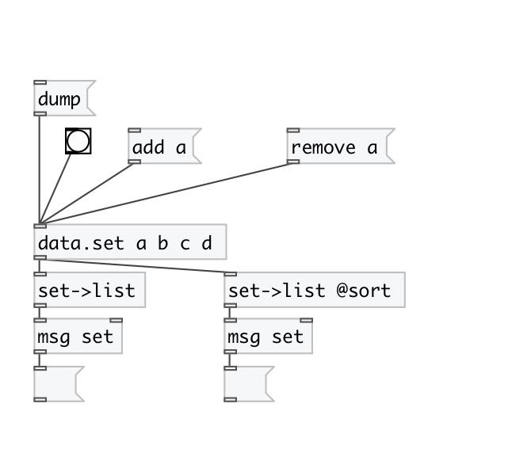

[< reference home](index.html)
---

# data.set2list

converts set to list

---

Note: output list is not sorted by default. You can use @sort flag to get sorted
            output
 

---

---
arguments:

---
properties:

@sort: if specified - sort output list 

---
see also: 

